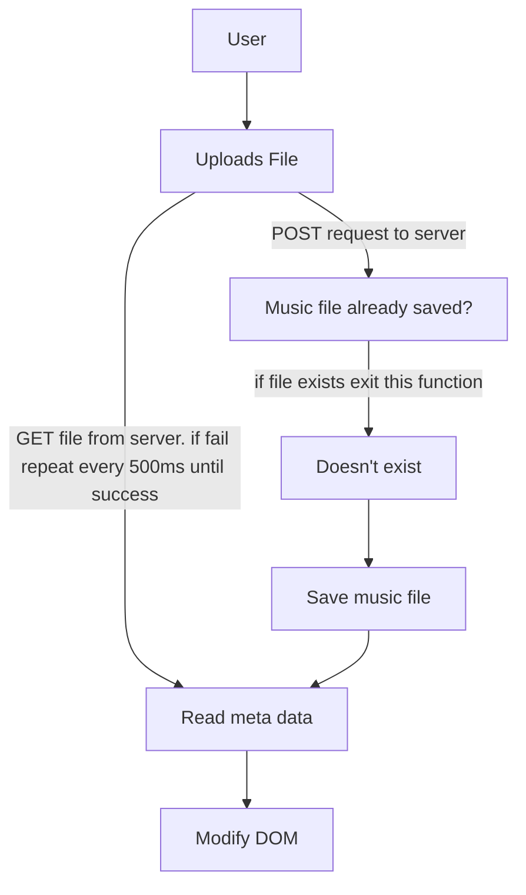
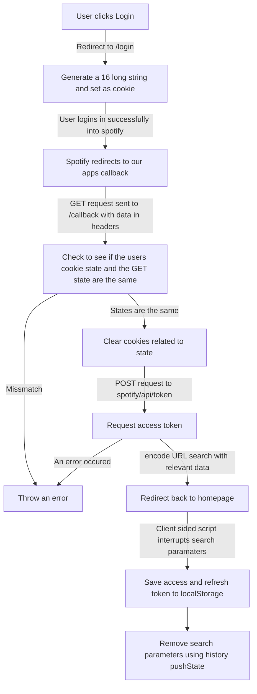
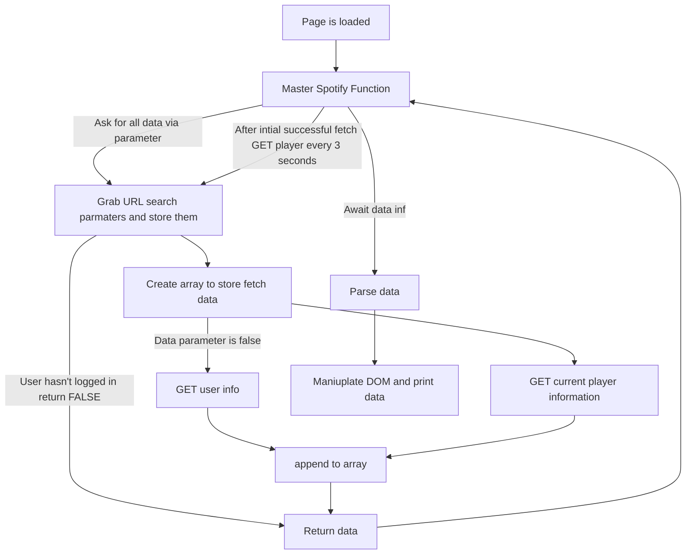

# Audio Analysis experimentation

Hi! This is one of my first published, **NodeJS** web applications! The project started of relatively small; only accepting inputs from the user but, grew in scope once a sizable web server *originally PHP* was implemented. The goal of the project was originally to create a tool, that would read the meta data of music/sound effects that I downloaded and return the meaningful data. ***Clearly*** after working on the project casually, the scope of the project idea expanded.

# Setup
### Spotify API
You will be required to create a new application through spotify to access their API. Go to the [developer dashboard](https://developer.spotify.com/dashboard/applications) *log in if you haven't* and create a new application. Once you've done that you can then grab your app's client ID and secret!
### secret.json
Where ever you install this project you need to also include a **secret.json** file in the same directory as the server. The contents of which should look like this:
```JSON
{
	"client_id": "SPOTIFY_APP_ID",
	"client_secret": "SPOTIFY_APP_SECRET"
}
```
### NPM
You'll also require to have a [download](https://nodejs.org/en/download/) of NodeJS on the system you wish this application to run on. 
> If you're to encounter any issues while the server runs
> use `npm install` to install any missing dependencies 

## Using the application

In this current build you're able to run the web server off **start.bat** which contains the commands to run the web server in a *development mode*.
> This will update every time modification to a meaningful file e.g. the index.js file the web server will restart.

You can start a web server by  going to the directory which you saved the project and typing the following.
> In windows 10 you can SHIFT+RIGHTCLICK to open either a powershell terminal or CMD in the directory
```sh
nodemon .
```
or
```sh
node index.js
```
## How it works

### File upload flow chart


---
### Spotify API
Some notes on the API.
 >**Timestamps for music are saved as UNIX dates in milliseconds.**
 >  This means to get the time for the song you need to create a date object with the timestamp then get minutes off the object.
>**All player modifications ***essentially all PUT*** require Spotify premium.**
> This may be subject to change in the future since the player API is currently in beta.
> **To access Spotify's API you require a client secret and the user to login** 

#### WEB SERVER (some client) Authenticating a user


#### CLIENT SIDE Accessing the player
> All requests are sent with the authorization code grabbed via oAuth. All Spotify API queries require an authorization code to respond correctly.
